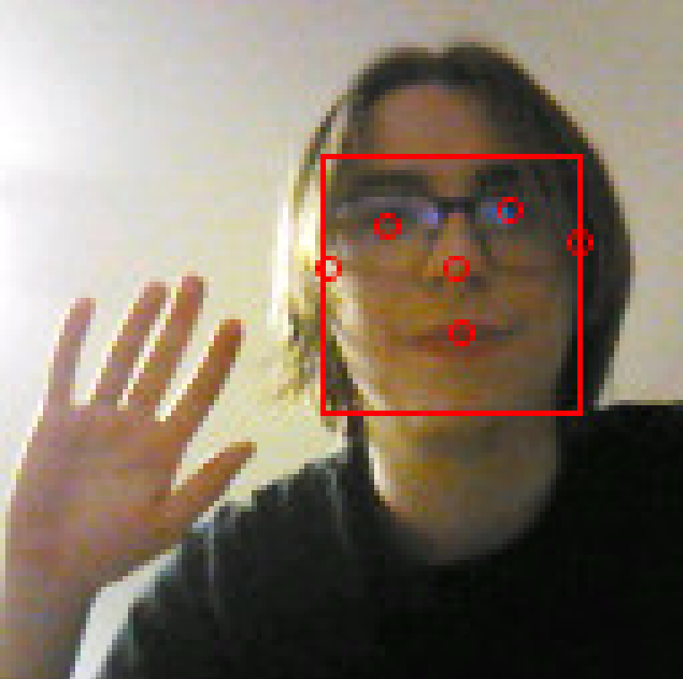

# OpenMV AI Face Detection Library

This project demonstrates how to use the AI Face Detection library on an OpenMV camera for face detection and angle tracking. The included example (`main_example.py`) shows how to capture images, detect faces, draw bounding boxes and keypoints, and calculate the angular offset of each detected face relative to the camera’s optical center.



---

## Overview

The AI Face Detection library (provided as `AI_FaceDetection.py`, `BlazeFaceDetector.py`, `BlazeFaceUtils`) implements Google MediaPipe face detection features optimized for the OpenMV camera. It automatically detects faces (up to eight per frame) in images, returns each face’s bounding box and facial keypoints, and even calculates the horizontal and vertical angles (relative to the camera center) for applications like head tracking.

To use the library, simply add the provided `.py` files to the same folder as your main script on the OpenMV filesystem. Then follow the structure in `main_example.py` to see how to use the library in practice.

---

## Requirements

- **OpenMV Camera:** OpenMV H7 model
- **OpenMV IDE:** The official development environment for OpenMV cameras. Download it from [openmv.io](https://openmv.io/pages/download).
- **Firmware File:** A `firmware.bin` file used to update your camera’s firmware

*See [firmware_compiled/README.md](firmware_compiled/README.md) for firmware flashing instructions and technical details about the custom firmware.*

---

## Library Usage

Each detection is a dictionary containing:

- `bounding_box`: Coordinates and dimensions of the face region
- `left_eye`, `right_eye`, `nose`, `mouth`, `left_ear`, `right_ear`: Coordinates for the facial keypoints
- `confidence`: A confidence score indicating detection quality

### Angle Calculation
To compute the angular position of a face relative to the camera’s center:
```python
angle_x, angle_y = detector.angle_relative_to_camera(detection)
```

---

## Example Workflow

The `main_example.py` provided in this project demonstrates a complete workflow:

1. Initialize and configure the sensor
2. Capture an image
3. Detect faces
4. Draw bounding boxes and keypoints on the detected faces
5. Calculate and print angle offsets of each face

You can run this example directly from the OpenMV IDE after connecting your camera.

---

## Related Documentation

For more information about the custom firmware used in this project, including:
- Why a new firmware is necessary
- How flash and RAM are restructured
- Step-by-step flashing instructions

Please see: [`firmware_compiled/README.md`](firmware_compiled/README.md)

---

Feel free to explore and modify the provided example and libraries to suit your AI face tracking application!