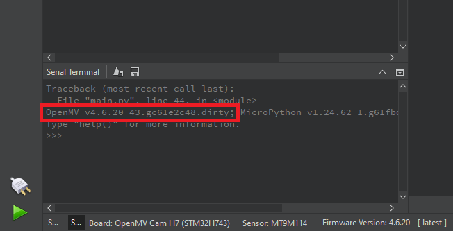

# Flashing Instructions and Firmware Overview

## How to Flash the Custom Firmware to Your OpenMV Camera

Follow these steps to update your OpenMV camera with the custom firmware provided in this folder:

### Step 1: Download and Install OpenMV IDE
- Visit [openmv.io](https://openmv.io/pages/download) to download the latest version of the OpenMV IDE
- Install it following the instructions for your operating system

### Step 2: Connect Your OpenMV Camera
- Plug your OpenMV camera into your computer via USB
- Launch the OpenMV IDE (it should automatically detect your camera)

### Step 3: Flash the Firmware
- In the IDE, go to **Tools > Run Bootloader** (or click the flash icon in the toolbar)
- When prompted, select the provided `firmware.bin` file from this folder
- Confirm and wait while the firmware is flashed
- Do **not** disconnect your camera during the process

### Step 4: Verify the Firmware Update
- After flashing, the IDE should reconnect automatically
- Use the console or settings panel to confirm the new firmware version

---

# Why a New Firmware

To run any AI model on the OpenMV camera, we need two things:

1. **Flash Space** to store the model  
2. **RAM** to perform model calculations

---

## 1. Flash Space

The OpenMV camera provides only **128KB** of flash memory for the user to save code, images, and models. This severely limits the size of any AI model—anything beyond ~100KB becomes impractical, and even smaller models consume valuable space needed for your code.

However, the camera reserves **1792KB** of flash memory for firmware. By compiling a custom firmware and removing unused components like Haar cascades and FOMO-based face detection from the `imlib_config.h` file, we can reduce the base firmware to around **1300–1400KB**, leaving space for models up to **~300KB**.

To include a model in the firmware:
- Disable unnecessary features in `imlib_config.h`
- Add your model to `lib/tflm/models/`

This approach allows us to embed a **quantized BlazeFace face detection model** directly into the firmware without consuming any user-accessible flash memory.

---

## 2. RAM Space

Running a model requires loading it into **RAM**, which must accommodate:
- The model weights
- The largest layer during inference

The board splits its 1MB of RAM primarily into two regions:
- **Frame Buffer (FB):** Stores and processes camera images (~400KB)
- **MicroPython Heap:** Executes Python code and ML algorithms (~267KB)

This default configuration is not ideal. A quantized model (~200KB) barely fits in the heap, leaving little space for operations or additional libraries.

### Firmware Modification
The new firmware adjusts this memory split:
- **Frame Buffer:** reduced to **168KB**
- **MicroPython Heap:** increased to **499KB**

This trade-off limits the maximum image size but enables:
- Running larger quantized models
- Loading more libraries
- Performing additional data processing tasks

---

## Optimization Tweak

An additional optimization was made to one of the machine learning libraries to eliminate redundant image copies during normalization. The original process duplicated every image before scaling, wasting memory and time.

---

**PS:** More details on these changes can be found by examining the `firmware_src` Git commit history and comparing it to the main branch.

